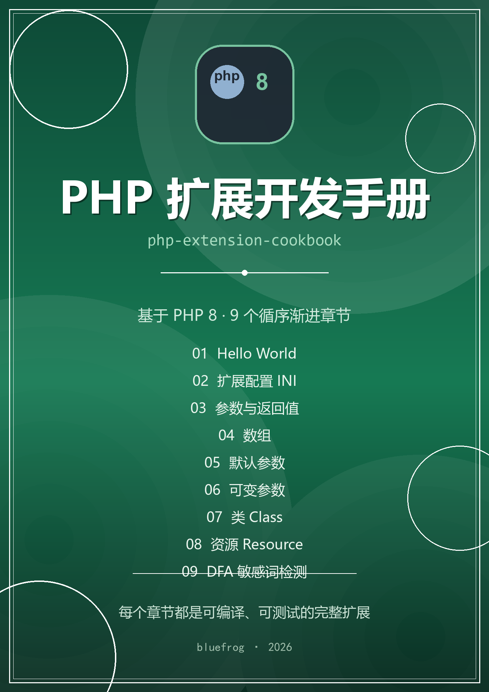

# PHP8 Extension Cookbook

> 基于 PHP 8 的扩展开发教程

从零开始，用 9 个循序渐进的章节，覆盖 PHP 扩展开发的核心知识点：
环境搭建、函数、参数与返回值、数组、默认参数、可变参数、类、资源、DFA 敏感词检测。

每一章都是一个**可以独立编译、可以 `make test`** 的完整扩展。

<!-- 封面页路由本身就是 #/，再点 #/ 不会跳转；
     用首页 H1 的锚点 (id=php-extension-cookbook) 才会真正进入正文 -->
[开始阅读](?id=php-extension-cookbook)
[GitHub](https://github.com/freewu/php-extension-cookbook)

